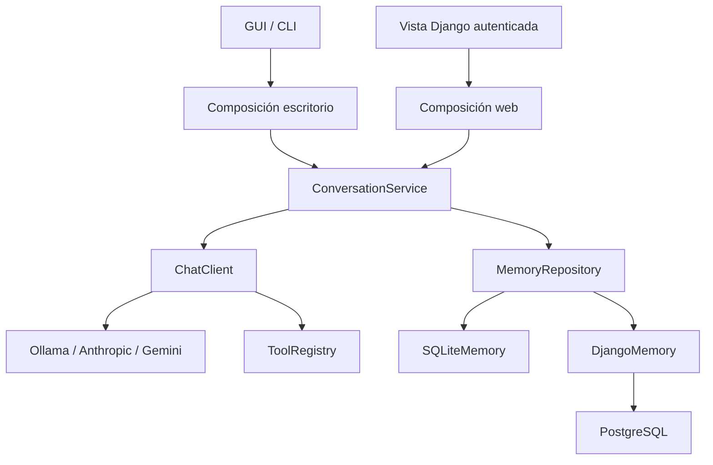
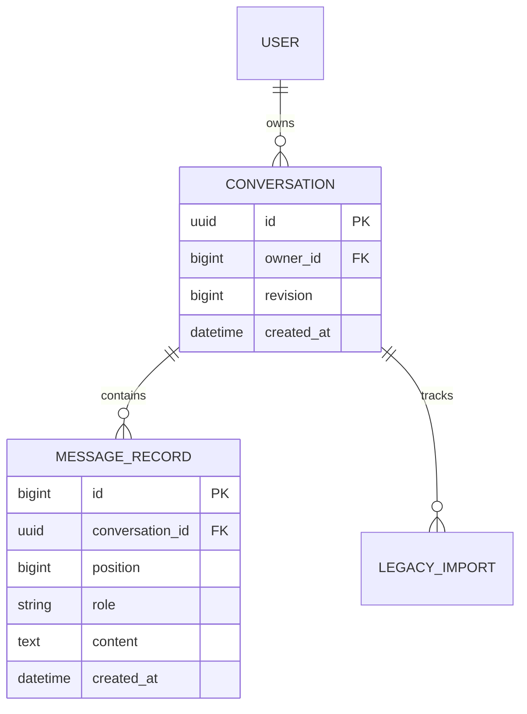

# Arquitectura y contratos

## Dependencias

El módulo `service` solo conoce protocolos de Python. `alicia_core` no importa `alicia_desktop`. La prueba de arquitectura analiza las importaciones para detectar regresiones. Django es opcional hasta importar explícitamente `django_app`.

## Contratos

- `Message(role, content)`: rol `user` o `assistant`, texto no vacío de hasta 16 000 caracteres.
- `MemoryRepository.snapshot(max_turns) -> Snapshot`: historial acotado y revisión consistente.
- `append_turn(user, assistant, expected_revision)`: guarda ambos mensajes y aumenta la revisión dentro de una transacción. Un conflicto produce `ConversationConflict`.
- `clear()`: borra solo la conversación vinculada e invalida revisiones anteriores.
- `ChatClient.chat(history, user_message) -> str`: devuelve texto final o lanza una excepción segura. No persiste.
- `ToolRegistry.execute(name, arguments)`: registro cerrado. Las herramientas antiguas de texto usan `Tool`; `TypedTool[ArgsT]` valida un modelo Pydantic estricto, después valida el dominio y finalmente aplica la autorización antes del handler. La apertura de aplicaciones requiere confirmación local.

La memoria Django siempre recibe el ID de conversación y el ID entero del propietario autenticado. El ejemplo usa el modelo de usuario Django con PK entera; si el proyecto usa una PK personalizada, ajusta el contrato `owner_id` y el parser del comando de importación junto con sus pruebas.

## Persistencia y concurrencia

La posición es única dentro de una conversación; los roles tienen restricción en base de datos. No se mantiene una transacción abierta durante la llamada al proveedor. El guardado usa actualización condicional por revisión y crea los dos mensajes en la misma transacción. En PostgreSQL, la lectura usa `select_for_update` durante una transacción corta; SQLite local usa lectura transaccional y `BEGIN IMMEDIATE` al escribir.

Si dos solicitudes generan simultáneamente, una puede perder por conflicto y devolver HTTP 409: su respuesta no se guarda y no se reintenta automáticamente. Ambas pueden haber consumido cuota del proveedor. No hay cola distribuida ni garantía exactly-once de efectos externos. Web no dispone de efectos de escritorio; el escritorio serializa sus turnos y deduplica herramientas idénticas dentro de un turno.

## Límites y fallos

El historial se limita por turnos y caracteres, no por tokens reales. La salida solicitada al modelo tiene un límite de tokens. Cada turno tiene límites de rondas, número de herramientas, longitud de argumentos y resultados. La respuesta HTTP tiene un máximo de 2 MB. HTTPX aplica tiempos de conexión y lectura; el timeout de lectura es de inactividad, no un cronómetro global de toda la conversación. El coste máximo aproximado de espera aumenta con el número de rondas.

Los errores de proveedor no incluyen su cuerpo ni credenciales. Los logs guardan metadatos: tipo de fallo, nombre de herramienta o estado HTTP. La consola sí muestra la conversación para que el usuario la vea; no se copia automáticamente al archivo de logs.

El catálogo de herramientas es una dependencia, no una referencia al lanzador o avatar dentro del cliente LLM. Los formatos REST conservan `tool_name` de Ollama, IDs de Anthropic y partes opacas/firmas de Gemini durante el ciclo de herramientas. No se invocan funciones arbitrarias desde nombres producidos por el modelo.
